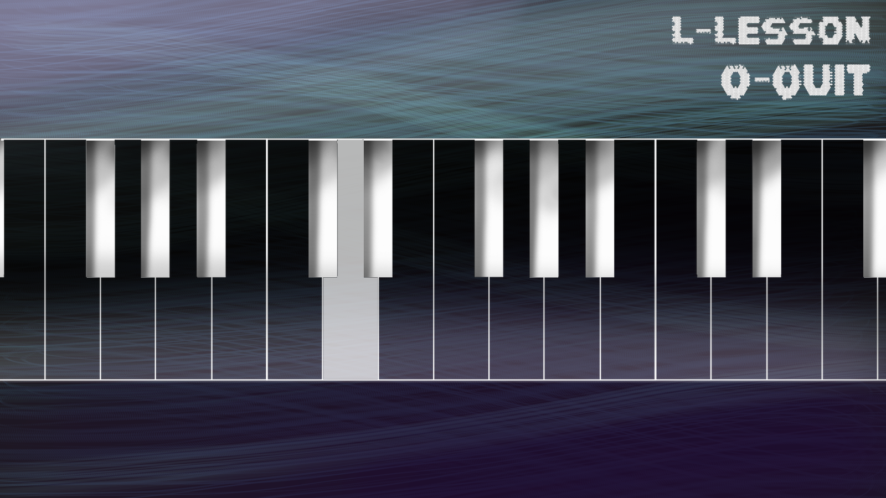

# ARM11 Group Project (Group 39) - 120.3 Programming III

## Table of Contents:
1. [Project Description](#projectdescription)
2. [Build Instructions](#buildinstructions)

<a name="projectdescription"></a>
## Project Description
### Authors: Bargavi Chandramouli, Christopher Gunadi, Esther Wong, Jasmine Quah
This project was completed as part of Imperial College's first year Computing CO120.3 Programming III course, and is comprised of four parts as follows:

## Part I - Emulator
Implements an ARM emulator, i.e. a program that simulates the execution of an ARM binary file on a Raspberry Pi.

## Part II - Assembler
Implements an ARM assembler, i.e. a program that translates an ARM assembly source file into a binary file that can subsequently be executed by the emulator.

## Part III - General Purpose Input/Output on Raspberry Pi
An ARM assembly program that flashes an LED on a provided Raspberry Pi.

This can be found in the `programs` directory, and was compiled and tested using the assembler from Part II.

## Part IV - Pi-ano
For this part, we were instructed to design, implement, and document an extension of our own choice. We chose to create a way for beginners to easily pick up and learn basic melodies on piano, as well as practice their playing.


We utilised the Pi to create a basic interactive 10-key piano, using LEDs and a GUI to aid memorisation. There are two modes of playing available on the Pi: freestyle and lesson mode. In freestyle mode, the Pi operates as a normal electronic keyboard, and the buttons on the Pi corresponding to keys on the piano can be pressed to produce audio and a flash on the corresponding LED. In lesson mode, lights on the LED light up until the corresponding key is pressed, teaching the user how to play a melody, which they can then practice without visual assistance in freestyle mode.



<a name="buildinstructions"></a>
## Build Instructions:

### Parts I, II:

#### To build both emulator and assembler: 
```sh
cd src
make all    # Generates object and executable files
make clean  # Removes generated object and executable files
```

#### To build emulator/assembler individually:
```sh
cd src/emulate_
make all   # Generates object and executable files
make clean # Removes generated object and executable files

cd src/assemble_
make all   # Generates object and executable files
make clean # Removes generated object and executable files
```

### Part IV:

```sh
cd src/game
make -f make_pi all          # Generates all object and executable files to run Pi-based program
make -f make_pi clean        # Removes generated object and executable files

make -f make_keyboard all   # Generates all object and executable files to run keyboard-based program
make -f make_keyboard clean # Removes generated object and executable files
```
